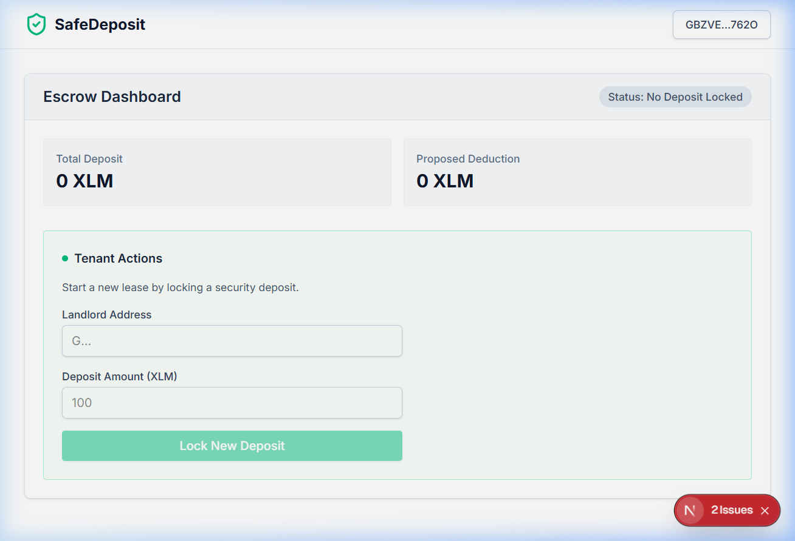
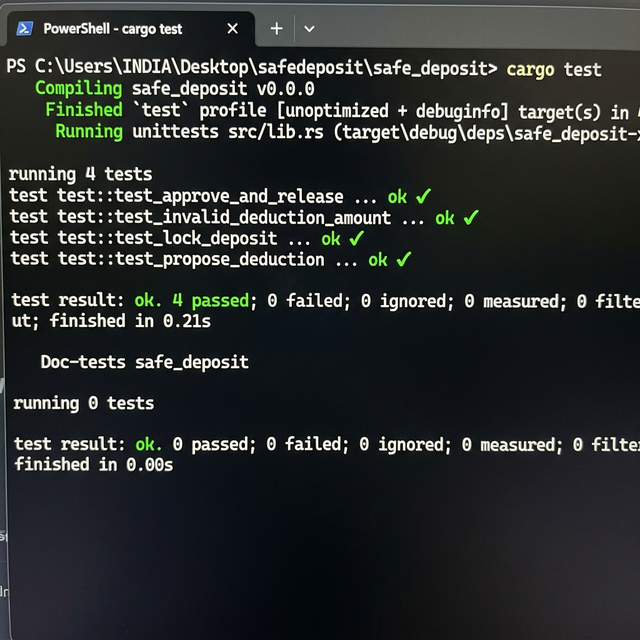

# SafeDeposit 🛡️ - Soroban Smart Lease Escrow

**SafeDeposit** is a decentralized smart lease escrow application built on the Stellar network using Soroban Smart Contracts. It aims to streamline and secure the process of managing rent security deposits between Tenants and Landlords without the need for traditional banking intermediaries.

This project was built as part of the **Rise In Stellar Journey to Mastery - Level 3**.

---

## 🔗 Project Links

* **Live Demo Link:** [https://frontend-o68avbd2t-mrunalghorpade13s-projects.vercel.app](https://frontend-o68avbd2t-mrunalghorpade13s-projects.vercel.app)
* **Full Process Demo Video:** [Google Drive Link](https://drive.google.com/file/d/1JbJvYUtTJDJz5UIifuqXdTqxS8j_JLNJ/view?usp=sharing)

### 🖥️ Frontend Preview


### ✅ Deployed Smart Contract
* **Network:** Stellar Testnet
* **Contract ID:** `CAZTP6HMOFZJBJC26DQRDCSMM43ZQ325YKVHCKW4PPR744C4WKJZ2D7L`
* **Deployer Address:** `GBZVEKLWICAUDTSOIMXZRA7XAMBXA4NMX3REYJIMQPY6762O`

### ✅ Test Verification — 4 Tests Passed


---

## 🎯 Project Description

SafeDeposit solves the age-old problem of security deposit disputes. A Tenant locks their deposit in XLM natively into the smart contract while assigning their Landlord's wallet address. 

When the lease period is over:
1. **Landlord** can propose a deduction (in XLM) if there are damages.
2. **Tenant** reviews the proposed deduction. If approved, the contract automatically splits the funds: releasing the deduction to the Landlord and refunding the remainder to the Tenant.

The entire process is transparent, permissionless, and immutable.

## 💻 Tech Stack
* **Smart Contracts:** Rust, Soroban SDK
* **Frontend Framework:** Next.js (App Router), React
* **Styling:** Tailwind CSS, Lucide Icons
* **Web3 Integration:** `@stellar/freighter-api`, `@stellar/stellar-sdk`
* **State & Caching:** `@tanstack/react-query`

## 🚀 Local Setup Instructions

### Prerequisites
1. [Rust toolchain](https://www.rust-lang.org/tools/install)
2. `soroban-cli` installed
3. Node.js (v18+) and npm
4. [Freighter Wallet](https://freighter.app/) extension installed in your browser

### 1. Smart Contract
To build and test the Soroban smart contract:

```powershell
cd safe_deposit
# Run tests
(gc Cargo.toml -Raw) -replace 'crate-type = \["cdylib", "rlib"\]','crate-type = ["rlib"]' | sc Cargo.toml
cargo test
# Restore and build for WASM deployment (requires Stellar CLI v25+)
(gc Cargo.toml -Raw) -replace 'crate-type = \["rlib"\]','crate-type = ["cdylib", "rlib"]' | sc Cargo.toml
rustup target add wasm32v1-none
stellar contract build
# Deploy to testnet
stellar keys generate deployer --network testnet --fund
stellar contract deploy --wasm target/wasm32v1-none/release/safe_deposit.wasm --source deployer --network testnet
```


### 2. Frontend Application
To run the Next.js React frontend:

```bash
cd frontend
# Install dependencies
npm install
# Run the development server
npm run dev
```

Open `http://localhost:3000` in your browser.

## 📖 User Guide & How to Use

The **SafeDeposit** dashboard dynamically adapts based on the connected wallet address and the current status of the escrow contract.

### 1. Connecting Your Wallet
* **Action:** Click the **"Connect Wallet"** button in the top right corner.
* **What it does:** Prompts the Freighter extension to connect your Stellar account. Once connected, your wallet address appears in the navbar and on the dashboard.

### 2. Tenant: Locking a Deposit
If no active contract is found for your address, the dashboard presents the **Tenant View**.
* **Action:** Enter the Landlord's Stellar address and the desired deposit amount (in XLM). Click **"Lock New Deposit"**.
* **What it does:** Initiates a transaction to lock your XLM into the smart contract and assigns the landlord. The dashboard will show a loading spinner, and the status will update to **Locked**.

### 3. Landlord: Proposing a Deduction
Once a deposit is locked, the designated Landlord can log in (connect their wallet) to see the **Landlord View**.
* **Action:** At the end of the lease, if there are damages, the Landlord enters a deduction amount and clicks **"Propose Deduction"**.
* **What it does:** Submits the deduction proposal to the contract. The status updates to **Pending Approval**, waiting for the Tenant.

### 4. Tenant: Approving the Release
The Tenant logs back in and sees the proposed deduction.
* **Action:** Review the Landlord's proposed deduction amount. Click **"Approve & Release"**.
* **What it does:** Finalizes the smart contract execution. The contract automatically transfers the deduction amount to the Landlord and refunds the remaining XLM back to the Tenant. The status updates to **Released**.

---

## 📜 Smart Contract Logic (`safe_deposit/src/lib.rs`)
* `lock_deposit`: Locks the XLM from the tenant and initiates the `Locked` state.
* `propose_deduction`: Allows the authorized landlord to propose damage costs. Moves to `PendingApproval`.
* `approve_and_release`: Tenant approves. Contract completes the deal. Moves state to `Released`.

---

## ✍️ Author

**Developed by Mrunal Ghorpade**
*Rise In Stellar Journey to Mastery - Level 3 Submission*

---

🚀 *Building the future of finance on Stellar.*
