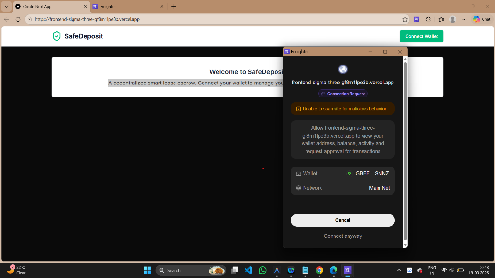
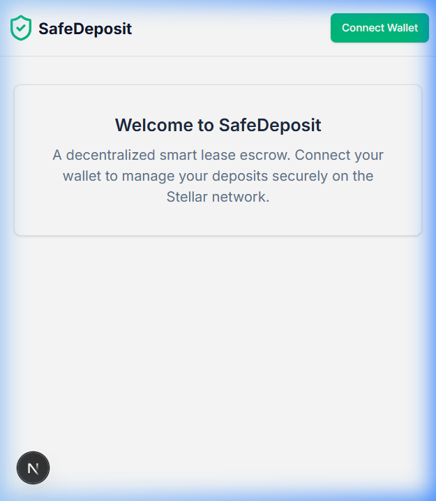
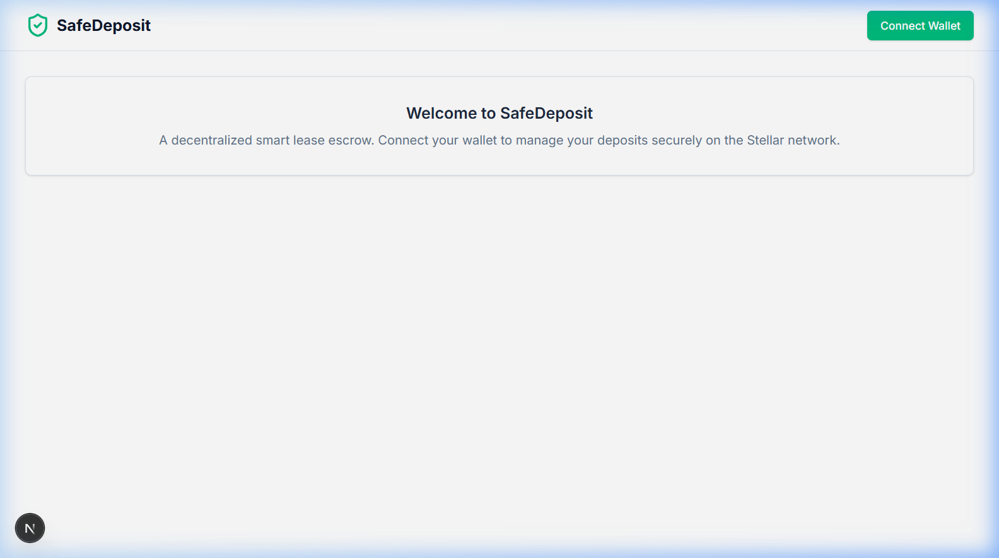
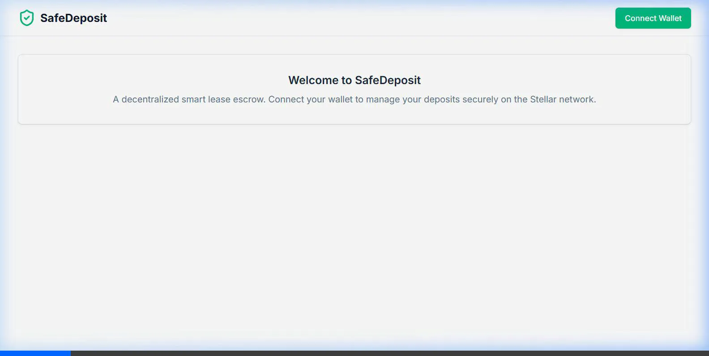

# SafeDeposit 🛡️ - Soroban Smart Lease Escrow

**SafeDeposit** is a decentralized smart lease escrow application built on the Stellar network using Soroban Smart Contracts. It secures the process of managing rent security deposits between Tenants and Landlords without traditional banking intermediaries.

[](https://github.com/MrunalGhorpade13/Safe-Deposit/actions/workflows/main.yml)
[](https://frontend-sigma-three-gf8m1lpe3b.vercel.app)

---

## 🔗 Project Resources

| Feature | Link |
| :--- | :--- |
| **Live Demo** | [https://frontend-sigma-three-gf8m1lpe3b.vercel.app](https://frontend-sigma-three-gf8m1lpe3b.vercel.app) |
| **Demo Video (Level 4)** | [Watch Full Process Demo](./demo/safedeposit_demo.webp) |
| **Source Code** | [GitHub Repository](https://github.com/MrunalGhorpade13/Safe-Deposit) |

---

## 🌟 Level 3: Core Project Development

In Level 3, the foundational escrow protocol was built to allow trustless management of security deposits between Tenants and Landlords on the Stellar Testnet.

### 🎯 Core Features & Escrow Flow
1. **Tenant: Secure Locking** — Tenants lock XLM into the escrow contract by specifying the landlord's address. Funds are held securely until the lease ends.
2. **Landlord: Proposed Deductions** — At the end of the lease, landlords can propose a deduction for damages.
3. **Mutual Release** — Once the tenant approves, the contract automatically splits funds: deduction to the landlord, remainder back to the tenant.

### 💻 Tech Stack (Level 3 Foundation)
* **Smart Contracts:** Rust, Soroban SDK
* **Frontend:** Next.js (App Router), React
* **Styling:** Tailwind CSS, Lucide Icons
* **Web3:** `@stellar/freighter-api`, `@stellar/stellar-sdk`
* **State & Caching:** `@tanstack/react-query`

### 📜 Smart Contract Logic (`safe_deposit/src/lib.rs`)
* `lock_deposit` — Locks XLM from the tenant. Initiates `Locked` state.
* `propose_deduction` — Landlord proposes damage costs. Moves to `PendingApproval`.
* `approve_and_release` — Tenant approves. Contract splits funds. Moves to `Released`.

---

## 🚀 Level 4: Production-Readiness Advancements

Building upon Level 3, the project was upgraded to meet all **Level 4 Production-Readiness** requirements.

### ✅ Level 4 Submission Checklist
- [x] **Inter-contract Call** — Integrated `FeeCollector` contract for automated protocol fee routing on every deposit lock.
- [x] **Real-time Event Streaming** — Frontend polls Soroban events (`DepositLocked`, `DeductionProposed`, `DepositReleased`) for instant UI updates.
- [x] **Mobile Responsive** — Fully responsive dark-mode UI verified on mobile viewports.
- [x] **CI/CD Pipeline** — GitHub Actions workflow runs Rust tests and Next.js build on every push.
- [x] **Live Deployment** — Hosted on Vercel with automated deployment from the `main` branch.
- [x] **8+ Meaningful Commits** — See full commit history below.
- [x] **Premium UI/UX** — Glassmorphism design with animated backgrounds, real-time state transitions.
- [x] **Error Handling** — React Error Boundaries and dynamic toast feedback for RPC/Wallet failures.

---

## 🔗 Contract Addresses & Transaction Hashes

| Contract | Address / ID |
| :--- | :--- |
| **SafeDeposit (Core Escrow)** | `CCLC7I4IBTPBP2EIRXSOVV4HPFNHH5CRWZF6Y7MC5RWFH2RDA4LMPK3` |
| **FeeCollector (Inter-contract)** | `CC4IQFJQVTZG77KDCOKWXU7MU3RQOIOA6GBLQDKW5YL3P3Q5E62SQAS` |
| **Network** | Stellar Testnet |

---

## 📸 Visual Proof

### 🖥️ 1. Live Wallet Connection
The application seamlessly integrates with the **Freighter Wallet** to manage Stellar accounts.


### 📱 2. Mobile Responsive View
The dashboard is fully responsive and works seamlessly on all screen sizes.


### 🖥️ 3. Full Desktop Dashboard


### ✅ 4. CI/CD Pipeline — Rust Tests Passing
The GitHub Actions pipeline runs `cargo test` on every push to ensure contract integrity.


### 🎥 5. Level 4 Demo Video — Full Escrow Flow
Watch the complete flow: wallet connection → locking a deposit → proposing a deduction → automated release.


---

## 🛠️ Technical Architecture

| Component | Technology | Description |
| :--- | :--- | :--- |
| **Smart Contracts** | Rust / Soroban | Core escrow logic + cross-contract fee collection |
| **Frontend** | Next.js 16 / React | Responsive dashboard with real-time state management |
| **Styling** | Tailwind CSS | Premium dark-mode aesthetic with custom animations |
| **Web3 Integration** | Freighter / Stellar SDK | Seamless wallet connection and transaction signing |
| **Infrastructure** | GitHub Actions / Vercel | Automated CI/CD for contract testing and UI deployment |

---

## 🚀 Setup & Execution

### 1. Smart Contract
```bash
cd safe_deposit
stellar contract build
stellar contract test
```

### 2. Frontend Application
```bash
cd frontend
npm install
npm run dev
```

Open `http://localhost:3000` in your browser with the Freighter Wallet extension installed and set to **Testnet**.

---

## ✍️ Author
**Developed by Mrunal Ghorpade**  
*Rise In Stellar Journey to Mastery — Level 3 & Level 4*

🚀 *Building the future of finance on Stellar.*
